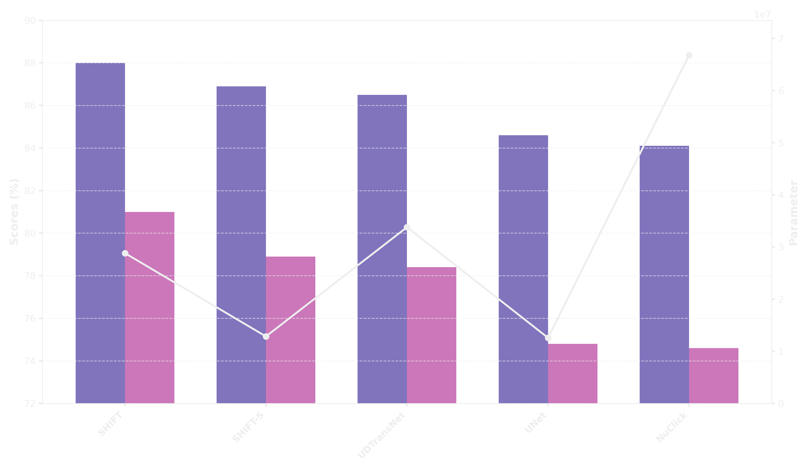

### Ähnlichkeiten

Das Netzwerk orientiert sich an der U-Net-Architektur von [Ronneberger et al.](https://arxiv.org/abs/1505.04597), die sich als herausragend für die Segmentierung medizinischer Aufnahmen etabliert hat. Die typische U-Form dieser Architektur wird übernommen, jedoch durch die Integration verschiedenster Layer, Aktivierungen und Transformer-Komponenten weiterentwickelt und optimiert.

### Vergleich

Das Eff-ResSepUTransNet erzielt hervorragende Ergebnisse in der semantischen Segmentierung. Es ist bereits das leistungsstärkste Netzwerk, das auf dem speziell für dieses Projekt zusammengestellten Datensatz trainiert wurde, und zählt zudem zu den schnellsten und effizientesten Modellen im Hinblick auf die Parameteranzahl. Auch außerhalb der interaktiven Segmentierung hat sich das Modell bewährt: Es wurde auf Masken des interaktiven Datensatzes semantisch trainiert und lieferte dabei ebenfalls ausgezeichnete Ergebnisse, die gängige Literaturwerte übertreffen würden.

In dem unten stehenden Graphen sind ausgewählte Modelle dargestellt, die den aktuellen Stand der Technik sowie ihre Basisarchitekturen repräsentieren. Die Modelle von SeesDisease schneiden sowohl hinsichtlich der Parameteranzahl als auch der Metriken unter gleichen Bedingungen am besten ab. Weitere Tests deuten darauf hin, dass das Eff-ResSepUTransNet das Potenzial hat, in weiteren Benchmarks eine Spitzenposition einzunehmen.

  
